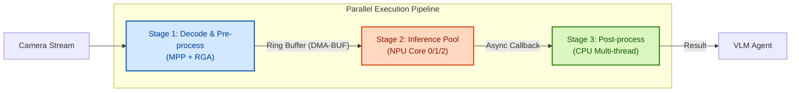

# RAVEN (Rockchip Accelerated Vision Edge Node)

**High-Performance Edge Perception System based on RK3588 & Qwen3-VL**

  

## 📖 Introduction
**RAVEN** is a full-stack embedded AI solution designed for the Rockchip RK3588 platform. It integrates a custom-built Linux BSP, a zero-copy hardware acceleration pipeline, and state-of-the-art Visual Language Model (VLM) deployment. 

The project aims to solve the bottleneck of CPU memory copying and sequential execution in traditional edge AI pipelines. By leveraging **DMA-BUF (DRM) Zero-Copy**, **CPU/NPU Asynchronous Parallelism**, and **Multi-threaded Inference Pools**, RAVEN achieves real-time semantic understanding of video streams with maximized hardware utilization.

## 🚀 Key Features

### 1. Custom Linux BSP Construction
- **U-Boot & Kernel Porting**: Built from Rockchip SDK source; customized Device Tree (DTS) for specific carrier boards.
- **System Optimization**: Tailored RootFS with PREEMPT_RT patch for real-time control capability.
- **Driver Development**: Integrated drivers for MIPI-CSI cameras and NPU/RGA kernel modules.

### 2. Zero-Copy Hardware Pipeline
- **MPP (Media Process Platform)**: Hardware decoding for up to 8-channel 1080p video streams.
- **RGA (Raster Graphic Acceleration)**: Hardware-accelerated color space conversion (NV12 -> RGB) and resizing.
- **DRM Zero-Copy**: Implemented physical address mapping to share memory between decoder (VPU) and inference engine (NPU), eliminating CPU `memcpy` overhead.

### 3. Advanced Acceleration Strategies
- **3-Stage Pipeline**: Decoupled Pre-processing (RGA), Inference (NPU), and Post-processing (CPU) into independent stages connected by ring buffers, hiding latency through overlapping execution.
- **CPU/NPU Asynchronous Parallelism**: Implemented non-blocking NPU submission mechanism, allowing the CPU to prepare the next frame's data while the NPU computes the current frame.
- **Multi-thread Inference Pool**: Managed a thread pool to fully saturate the **3-Core NPU** architecture of RK3588, enabling load balancing and parallel execution of multiple inference requests.

### 4. Edge VLM Deployment (Qwen3-VL)
- **Model**: **Qwen3-VL-2B-Instruct** (Latest Edge-optimized VLM).
- **Quantization**: W4A16 (4-bit weights, 16-bit activation) hybrid quantization using RKNN-Toolkit2.
- **Performance**: Achieves **~12 tokens/s** inference speed with pipeline optimizations.

## 🏗 Architecture



## 📊 Performance Benchmarks

| Module | Task | Strategy | FPS / Speed | CPU Usage |
| :--- | :--- | :--- | :--- | :--- |
| **Pipeline** | End-to-End Processing | Sequential Execution | 18 FPS | 45% |
| **Pipeline** | End-to-End Processing | **Async Pipeline + Thread Pool** | **28 FPS** | **60% (Balanced)** |
| **Inference** | Qwen3-VL-2B (W4A16) | Single Thread | 8 tokens/s | NPU Low Load |
| **Inference** | Qwen3-VL-2B (W4A16) | **Multi-Core Parallelism** | **12 tokens/s** | NPU Full Load |

## 🛠️ Build & Usage

### Prerequisites
*   Hardware: RK3588 / RK3588S EVB or Custom Board.
*   Host: Ubuntu 20.04/22.04 (Cross-compilation environment).
*   SDK: Rockchip Linux SDK 6.0+ (Support for newer Transformer ops).

### 1. Build BSP (Optional)
If you need to build the OS image from scratch:
```bash
./build.sh uboot
./build.sh kernel
./build.sh rootfs
./build.sh firmware
```

### 2. Compile Application
```bash
mkdir build && cd build
cmake .. -DCMAKE_TOOLCHAIN_FILE=../cmake/rk3588_linux.cmake
make -j8
```

### 3. Run Demo
Transfer the executable and model (`qwen3vl_w4a16.rknn`) to the board. 
Enable the thread pool with `-t` argument:
```bash
# On RK3588 device (Run with 3 inference threads)
sudo ./raven_vlm_demo --model ./models/qwen3vl_w4a16.rknn --input video_sample.mp4 --threads 3
```

## 📂 Project Structure
```text
RAVEN
├── bsp/                # Kernel config, DTS overlays, and U-Boot patches
├── src/
│   ├── core/           # Pipeline manager & Thread pool implementation
│   ├── hardware/       # MPP and RGA wrapper classes
│   ├── model/          # RKNN inference engine interface
│   └── utils/          # DRM memory & Ring buffer utils
├── models/             # Quantization scripts and configs for Qwen3-VL
├── docs/               # Architecture diagrams and performance reports
└── README.md
```
