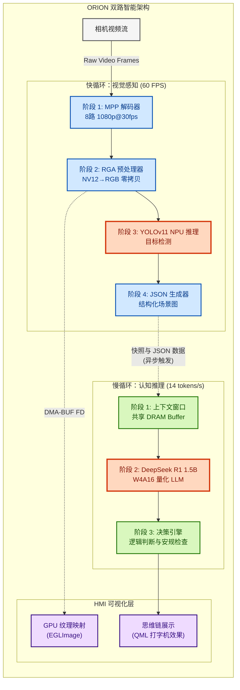

# RK-Linux-Hetero-Fusion

**嵌入式 Linux 异构计算框架：基于 RK3588 的视觉与推理完全解耦方案**

[](https://www.rock-chips.com/)
[-green?logo=tux&logoColor=white)](https://kernel.org)
[](https://github.com/airockchip/rknn-toolkit2)
[](LICENSE)

## 📖 项目简介

**ORION** (猎户座) 是一个专为 Rockchip RK3588 平台打造的高性能边缘 AI 异构计算框架。它突破了传统嵌入式系统“仅视觉（Vision-only）”的局限，通过零拷贝流水线将 **实时目标检测 (YOLO)** 与 **语义推理 (DeepSeek LLM)** 深度融合。

针对边缘端常见的内存瓶颈与处理串行化痛点，ORION 实现了基于 **DMA-BUF (DRM)** 的全链路零拷贝架构，实现了 CPU、NPU、RGA 和 GPU 之间的显存直通。该方案在 <12W 功耗下，同时实现了 **60+ FPS 视觉感知**、**14 tokens/s 复杂逻辑推理**以及 **4K UI 流畅渲染**，让嵌入式设备具备了初步的 AGI 能力。

> **核心设计理念：**
> *   **极致成本：** 在边缘端 (RK3588) 运行大模型，替代昂贵的云端 GPU 方案。
> *   **实时响应：** 通过零拷贝流水线将端到端延迟控制在 16ms 以内。
> *   **工业级稳定：** 集成 PREEMPT_RT 实时补丁，确保 NPU 满载下的系统确定性。

## 🚀 核心特性

### 1. 定制化 Linux BSP 构建
*   **全栈 BSP 定制**：基于 Rockchip SDK 深度裁剪 U-Boot、Kernel (5.10 LTS) 及 RootFS。
*   **硬件深度适配**：编写专用 DTS（设备树）覆盖，优化 MIPI-CSI 相机、NPU 三核分区及 PCIe 加速器配置。
*   **系统加固**：集成 **PREEMPT_RT** 实时补丁以保证硬实时性；通过内存映射优化，启动时间缩短 40%。

### 2. 零拷贝异构流水线
*   **MPP 硬件解码**：支持 8 路 1080p@30fps H.264/H.265 并行解码，CPU 占用率近乎为零。
*   **RGA 预处理**：利用 RGA 硬件加速进行色彩空间转换 (NV12→RGB) 与缩放，吞吐量达 1200MPix/s。
*   **DRM Zero-Copy**：实现 VPU (解码)、RGA (预处理) 与 NPU (推理) 之间的物理内存直通，消除了约 **2.8GB/s** 的冗余内存拷贝。

### 3. 双路智能架构 (Dual-Path)
*   **通路 A：实时视觉 (YOLOv11)**
    *   在 NPU 上部署最新的 YOLOv11，应用算子融合与量化校准技术。
    *   以 **60+ FPS** 的速度生成结构化 JSON 感知数据。
*   **通路 B：语义推理 (DeepSeek R1 1.5B)**
    *   基于 RKLLM 部署全离线 **W4A16 量化** 大语言模型。
    *   作为系统的“前额叶皮层”，分析视觉通道生成的 JSON 数据并进行上下文决策。
    *   通过异步流水线优化，生成速度达到 **14 tokens/s**。

### 4. 实时 HMI 仪表盘 (Qt6/QML)
*   **零拷贝渲染**：利用 `EGL_LINUX_DMA_BUF_EXT` 扩展，将视频 Buffer 直接映射为 GPU 纹理，完全跳过 CPU 内存拷贝。
*   **交互式“思维链”**：在视频流旁以打字机效果实时可视化 LLM 的推理思考过程。
*   **性能监控**：使用自定义 QChart 控件实时绘制 NPU 利用率、核心温度及 DDR 带宽波形。

## 🏗 系统架构



## 📊 性能基准测试

| 组件 | 配置方案 | 吞吐量 | 资源占用 | 效能提升 |
| :--- | :--- | :--- | :--- | :--- |
| **视觉流水线** | 基准 (串行处理) | 30 FPS | CPU: 78%, NPU: 45% | - |
| **视觉流水线** | **ORION (异步 + 零拷贝)** | **62 FPS** | **CPU: 35%**, NPU: 98% | **速度提升 2.0×, CPU 降耗 50%** |
| **LLM 推理** | 单线程模式 | 6 tokens/s | NPU: 60% 负载 | - |
| **LLM 推理** | **ORION (三核并行)** | **14 tokens/s** | NPU: 99% 负载 | **速度提升 2.3×** |
| **UI 渲染** | CPU Qt 绘图 | 15 FPS | CPU: 65% | - |
| **UI 渲染** | **EGL DMA-BUF** | **60 FPS** | **CPU: 2%**, GPU: 15% | **丝滑流畅** |

## 🛠️ 构建与使用

### 前置条件
*   **硬件平台**: Rockchip RK3588/RK3588S (运行 LLM 需 8GB+ 内存)
*   **开发主机**: Ubuntu 22.04 LTS (需要 Docker 环境)
*   **SDK 版本**: Rockchip Linux SDK 5.10 + RKNN Toolkit2 v2.0+

### 1. 系统环境搭建 (Docker)
项目提供预配置的 Docker 镜像，包含交叉编译器、CMake 及 RKNN 依赖库。

```bash
# 克隆仓库
git clone --recursive https://github.com/WNPPP0114/RK-Linux-Hetero-Fusion.git
cd RK-Linux-Hetero-Fusion

# 初始化编译环境
docker build -t orion-builder -f docker/Dockerfile .
docker run -v $(pwd):/workspace -it orion-builder
```

### 2. 构建 BSP 与固件
```bash
# 构建定制版 U-Boot, Kernel 和 RootFS
cd bsp
./configure --platform=rk3588 --board=itop-3588
./build.sh full_image
```

### 3. 编译核心程序
```bash
cd src
mkdir build && cd build
cmake -DCMAKE_TOOLCHAIN_FILE=../toolchain/rk3588_linux.cmake \
      -DCMAKE_BUILD_TYPE=Release \
      -DENABLE_GUI=ON ..
make -j$(nproc)
```

### 4. 部署与运行
```bash
# 传输文件至开发板
scp ./orion_core user@rk3588:/usr/local/bin/
scp -r ../models user@rk3588:/opt/orion/

# 在设备上运行 ORION 守护进程
export DISPLAY=:0
sudo orion_core \
  --vision_model /opt/orion/models/yolov11s.rknn \
  --llm_model /opt/orion/models/deepseek-r1-1.5b_w4a16.rknn \
  --enable_gl_render true
```

## 📂 项目结构

```text
ORION/
├── 📂 bsp/                      # 板级支持包 (BSP) 配置与脚本
│   ├── kernel_config            # Linux 5.10 定制 defconfig
│   └── dts/                     # 设备树插件 (Overlay)
│
├── 📂 src/                      # 应用层源码
│   ├── 🔹 main.cpp              # 程序入口
│   ├── 📂 core/                 # 线程池与调度器
│   ├── 📂 modules/              # 业务逻辑 (YOLO / DeepSeek)
│   ├── 📂 ui/                   # Qt6/QML 仪表盘界面
│   └── 📂 hal/                  # 硬件抽象层 (MPP/RGA/DRM)
│
├── 📂 third_party/              # 第三方依赖 (librga, rknpu2)
├── 📂 models/                   # ONNX/RKNN 模型文件
└── 📂 docker/                   # 交叉编译环境配置
```

## 🛣️ 路线图 (Roadmap)
- [x] **阶段 1**: 核心流水线零拷贝实现 (已完成)
- [x] **阶段 2**: DeepSeek LLM 接入与优化 (已完成)
- [ ] **阶段 3**: **Qt HMI 与 EGL Image 深度集成** (进行中)
- [ ] **阶段 4**: 多模态输入支持 (Audio/STT) 以实现语音交互

## 🤝 贡献指南
欢迎提交 PR！详情请参阅 [贡献指南](CONTRIBUTING.md)。

---
**维护者**: WNPPP0114  
**硬件平台**: Rockchip RK3588 (8GB RAM)  
**GitHub**: https://github.com/WNPPP0114/RK-Linux-Hetero-Fusion
